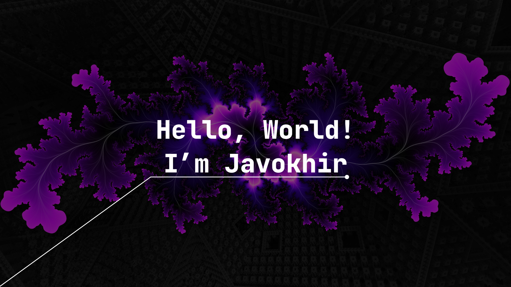

<!-- ABOUT YOU -->

<h3 align="center">I love to code, create things, solve problems and take on challenges</h3>
  <ul>
    <li>🔭 I’m currently studying at <strong>School 21</strong></li>
    <li>🌱 I’m currently learning <strong>C, Kotlin, Android, Jetpack Compose, Docker and more</strong></li>
    <li>📫 How to reach me <strong>javokhir.m@outlook.com</strong></li>
  </ul>

<!-- CONNECTION -->

  
<h3 align="center">Connect with me:</h3>

  

<!-- LANGUAGES AND TOOLS -->

<h3 align="center">Languages and Tools:</h3>

 
  
  
   

  
  
  

   
  
     
     
    

<!-- SUPPORT -->

<!-- GITHUB STATS -->

  <h3 align="center">Stats:</h3>

    <a align="left">
      

</a>
    <a align="right">
 
</a>  
  

 
 
 
 
 
 
 
 
 
 
 
